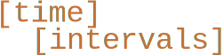
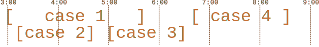

timeintervals is a small python library useful for working with intervals (or sets) of time.  

## Usage
Lets look at the motivating problem to understand how to use timeintervals.  

Suppose you are managing a team of anesthesiologists. 
They need to be available 24/7 to repond to patient emergencies, and even routine, planned procedures can go longer than intended, so overtime pay is necessary.
Attending anesthesiologists at teaching hospitals, however, typically aren't doing just one case, they're supervising multiple residents or nursing anesthetists and responding to their calls for assistance when necessary.
Thus, their cases can often look like this:  



If we just count the minutes that the anesthesiologist worked, we would be double counting the minutes where two cases were occuring at the same time.
We need to deduplicate and use only the time the anesthesiologist was in *any* case.  
Lets use **timeintervals** to solve this problem.  
### Representing Cases with TimeInterval
To create a TimeInterval, we can parse the case's start and end times from strings.
```python
from timeintervals import TimeInterval
from typing import List

cases_strs: List[str] = [
    ("2025-10-16 15:00", "2025-10-16 17:45"),
    ("2025-10-16 15:15", "2025-10-16 16:45"),
    ("2025-10-16 17:00", "2025-10-16 18:30"),
    ("2025-10-16 17:45", "2025-10-16 20:30")
]
time_format: str = "%Y-%m-%d %H:%M"
cases: List[TimeInterval] = [
    TimeInterval.from_strings(start, stop, time_format)
    for (start, stop) in cases_strs
]
for (index, case) in enumerate(cases):
    print(f"Case {index}: {case}")
```
```
Case 0: TimeInterval(start=2025-10-16 15:00:00, end=2025-10-16 17:45:00)
Case 1: TimeInterval(start=2025-10-16 15:15:00, end=2025-10-16 16:45:00)
Case 2: TimeInterval(start=2025-10-16 17:00:00, end=2025-10-16 18:30:00)
Case 3: timeInterval(start=2025-10-16 18:45:00, end=2025-10-16 20:30:00)
```

### Getting Ready for Set Operations with TimeSet
To perform the set-like operations we want to do on these cases, we need to create a TimeSet.  
A TimeSet is composed of a list of TimeIntervals, and exposes set operations like intersection, union, add, and subtract.  
To create one, we simply run:
```python
from timeintervals import TimeSet

case_set: TimeSet = TimeSet(cases)
print(case_set)
```
```
TimeSet(time_intervals=['TimeInterval(start=2025-10-16 15:00:00, end=2025-10-16 17:45:00)', 'TimeInterval(start=2025-10-16 15:15:00, end=2025-10-16 16:45:00)', 'TimeInterval(start=2025-10-16 17:00:00, end=2025-10-16 18:30:00)', 'TimeInterval(start=2025-10-16 18:45:00, end=2025-10-16 20:30:00)'])
```

### Finding Time Spent in Cases with Union
To find out how many minutes the provider worked, we need is a **union** of all the time that the anesthesiologist worked.  
TimeSet has a built in method called `compute_union()` which will return a TimeSet containing the union of all the TimeIntervals in the TimeSet.
```python
unioned_case_set: TimeSet = case_set.compute_union()
for (index, interval) in enumerate(unioned_case_set.time_intervals):
    print(f"Interval {index}: {interval}")
```
```
Interval 0: TimeInterval(start=2025-10-16 15:00:00, end=2025-10-16 18:30:00)
Interval 1: TimeInterval(start=2025-10-16 18:45:00, end=2025-10-16 20:30:00)
```

### Finding Payable Time with Intersection
Overtime is not just how many minutes someone worked, but how many minutes they worked *over* a certain *time* (duh).  
Lets say the OR closes at 5:00pm, and any time over that is considered overtime until the start of the next morning.
To find this, we need the intersection of our union with the overtime.  

The `compute_internal_intersection` method computes the *internal* intersection of the TimeSet.  
To find the intersection between a TimeSets and an overtime TimeInterval, we ensure the TimeSet is internally disjoint, and find the intersection of all its TimeIntervals with the overtime TimeInterval.
```python
from datetime import datetime
# we can also construct timeintervals from datetime objects.
overtime_start: datetime = datetime(year=2025, month=10, day=16, hour=17, minute=0)
overtime_end: datetime = datetime(year=2025, month=10, day=17, hour=6, minute=0)

overtime: TimeInterval = TimeInterval(overtime_start, overtime_end)
overtime_worked: List[TimeInterval] = []
for interval in unioned_case_set.time_intervals:
    overtime_worked += TimeSet([overtime, interval]).compute_internal_intersection().time_intervals
print(TimeSet(overtime_worked))
```
```
TimeSet(time_intervals=['TimeInterval(start=2025-10-16 17:00:00, end=2025-10-16 18:30:00)', 'TimeInterval(start=2025-10-16 18:45:00, end=2025-10-16 20:30:00)'])
```

### Computing Payment
Finally, payment can be computed.
```python
payment_rate_per_hour: float = 30
one_hour_in_minutes: int = 60*60
get_hours_in_time_interval = lambda ti: ti.time_elapsed().total_seconds()/(one_hour_in_minutes)
hours_worked: int = sum(get_hours_in_time_interval(ti) for ti in overtime_worked)
payment: float = hours_worked*payment_rate_per_hour
print(f"Hours worked: {hours_worked}")
print(f"Hourly rate: {payment_rate_per_hour}$")
print(f"Payment: {payment:.2f}$")
```
```
Hours worked: 3.25
Hourly rate: 30$
Payment: 97.50$
```

### Paying On-Call Pager Time with Subtraction
Payment computation has been completed, except there is one problem: pager payments.
When anesthesiologists are on-call, they recieve a small amount of money when they *aren't* in cases.
How do we pay for time that *isn't* present in the data?  

We can use set subtraction.  
Suppose pager shift starts at 7:00pm and goes until 4:00am the next day at a rate of 20 dollars an hour.
We can build the pager shift as a TimeInterval, and subtract the unioned case time from it to get all the payable pager time.
```python
pager_start: datetime = datetime(year=2025, month=10, day=16, hour=19, minute=0)
pager_end: datetime = datetime(year=2025, month=10, day=17, hour=4, minute=0)
pager_shift: TimeSet = TimeSet([TimeInterval(pager_start, pager_end)])

payable_timeset: TimeSet = pager_shift - unioned_case_set
print(payable_timeset)
hours_worked: int = sum(get_hours_in_time_interval(ti) for ti in payable_timeset.time_intervals)
print(f"Payment: {20}($/hr) * {hours_worked}hrs = {20*hours_worked}$")
```
```
TimeSet(time_intervals=['TimeInterval(start=2025-10-16 20:30:00, end=2025-10-17 04:00:00)'])
Payment: 20($/hr) * 7.5hrs = 150.0$
```
